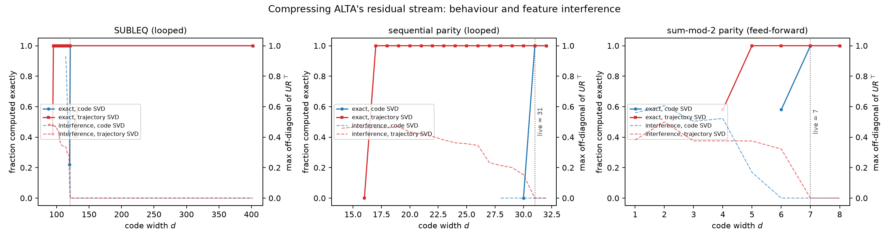

# Compressing ALTA's residual stream: the projection rule decides whether a compiled machine shares directions

Every ALTA program tested, looped or feed-forward, compresses below its live
dimension count with survivors in shared directions when the continuation drops the
direction the visited states use least. Under the projection rule LAC's learned-code
run used, which drops the direction the code itself uses least, every program instead
cliffs at exactly its live count with survivors exactly orthogonal, which is the LAC
result reproduced on a second compiler. The iteration-versus-feed-forward split
proposed in `PREDICTIONS.md` does not appear in either arm.

## Design

ALTA (Shaw et al. 2024, arXiv 2410.18077) compiles programs to Universal
Transformers. Three of its programs were compiled and their weights frozen: `subleq`,
a looped one-instruction computer over 16 positions with values in [-16, 16]
(402 residual dimensions, 121 live); `parity_seq`, a looped running parity (32
dimensions, 31 live); `parity_ff`, a fixed-depth parity by selector-width count
(8 dimensions, 7 live). A live dimension is one some weight reads and some visited
state uses. The only trainable object is a code `U` (D x d) applied to every residual
write, with readout `R` on every read, tied `R = U` as Tracr's shared-W convention.
The objective is the teacher-forced pair of hinges from LAC's `learned.py`: every
attention selection keeps half its compiled margin, every read coordinate lands within
its own decision tolerance. Codes are fit by continuation from the identity at
`d = D` down one dimension at a time. A width counts as working when the compressed
model matches the symbolic interpreter on all 16 positions of each of 100 held-out
inputs.

Two continuation rules were run.
`code` projects onto the top right-singular subspace of the code itself, as
`learned.py` did. `data` projects onto the top singular subspace of the code's image
of the visited states, so it drops the direction the trajectory uses least.
Interference is the largest off-diagonal of `U R^T` restricted to survivors, the
quantity plotted in `curves.png`.

## Numbers

| program | shape | live | `data` d_min | interference at d_min | `code` d_min | interference |
|---|---|--:|--:|--:|--:|--:|
| subleq | looped | 121 | 95 | 0.47 | 121 | 0.00 |
| parity_seq | looped | 31 | 17 | 0.46 | 31 | 0.00 |
| parity_ff | feed-forward | 7 | 5 | 0.38 | 7 | 0.00 |

Under `data`, one width below d_min the exact fraction is 0.42 for subleq, 0.00 for
parity_seq and 0.58 for parity_ff. Under `code`, one width below live it is 0.22,
0.00 and 0.58, and the first shared direction appears only there, after the machine
has already failed.

## Grading

**B1, the looped machine compresses only by deletion: refuted under `data`, confirmed
under `code`.** SUBLEQ reaches 95 of 121 live dimensions with interference 0.47, and
sequential parity 17 of 31 with 0.46. Under the code-SVD continuation both stop at
their live count with a zero Gram off-diagonal, exactly as LAC did.

**B2, the feed-forward program superposes: confirmed under `data`, refuted under
`code`.** Parity by count reaches 5 of 7 with interference 0.38, Tracr §5's pattern.
Under code-SVD it cliffs at 7 like the looped programs.

**B3, cliff for the looped machine, slope for the feed-forward one: refuted.** Under
`data`, SUBLEQ keeps 42 percent of inputs exact one width below d_min, more than
parity_ff's grading threshold of 5 percent. Sequential parity is the only program
that drops to zero, in both arms.

## Delta vs prior art and the LAC run

Tracr §5 (Lindner et al. 2023) compressed one feed-forward RASP program with a
learned projection and reported non-orthogonal survivors. This run reproduces that on
ALTA's feed-forward program and extends it to two looped programs, which compress the
same way. LAC's `RESULTS-A.md` reported that a stateful machine refuses to share at any
working width. The `code` arm here reproduces that outcome on three ALTA programs, and
the `data` arm removes it on the same three programs by changing one line of the
continuation. The LAC finding is therefore at least in part a property of the
projection rule its continuation used, and the LAC learned-code run should be
repeated with the `data` rule before its no-sharing claim is cited. What this run
does not test is LAC's other candidate explanation, that values up to 5050 read
against a tolerance of 0.5 leave no room for interference; ALTA's SUBLEQ holds values
in [-16, 16] as one-hot buckets, so its read tolerances are all of order 0.25.

## Limits

One seed per arm. The `code` arm's cliff at the live count may itself be an optimizer
artifact of the same kind the continuation was introduced to avoid. Three programs,
one compiler, CPU-sized instances. The hinge objective is the LAC one transplanted;
ALTA's MLPs are compiled lookup tables, so the tolerance hinge covers every read
coordinate at its own threshold rather than named rounded scalars, as
`PREDICTIONS.md` registered. Whether the `data`-arm codes generalise beyond the 100
held-out inputs was not measured.

## Files

`alta_common.py` wraps ALTA's compiler and interpreter and runs the compiled MLP
through CSR weights; `train_code.py` is the trainer with per-width checkpoints and
per-program resume; `run_all.sh` runs both arms; `plot_results.py` draws `curves.png`;
`test_alta_superposition.py` holds 18 tests including compiled-equals-interpreter on
every program and the identity code reproducing the compiled model. ALTA needs
`jax[cpu]`, `tensorflow-cpu` and `absl-py`; it imports cleanly under Python 3.11.
