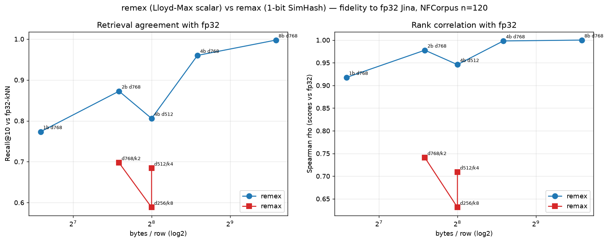
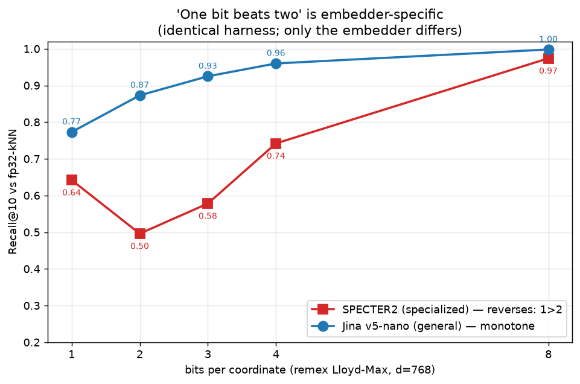

# remex vs remax as a compressed-Jina vector format

**Question (from Oskar):** can we apply the **remex** (not remax) quantization
optimizations to our Jina q4 embedding — and, loosened: can remex stand on its
own as a *practical compressed-Jina format*, an alternative to full-float
vectors, without having to beat remax at a fixed byte budget?

**Verdict:** Yes — and it more than clears that bar. Scored against the fp32
ranking itself, **remex (rotation + Lloyd-Max scalar quant) reproduces full-float
Jina retrieval far more faithfully than remax 1-bit centered-SimHash at equal or
fewer bytes.** remex 4-bit @ d=768 (384 B/row) is near-lossless (Spearman ρ=0.998,
R@10-vs-fp32=0.96 on NFCorpus); remex **2-bit @ 192 B** (ρ=0.978) beats the
remax d768/k2 config at the same 192 B (ρ=0.741); and remex **1-bit @ 96 B**
(half the bytes) still beats *every* remax config. The headline is **bits beat
stacks**: spending a byte budget on graded magnitude (Lloyd-Max) dominates
spending it on more sign-bits/rotations (stacked SimHash).

**Caveat up front (see Reconciliation):** this holds *for Jina*. The founding
remax result "one bit beats two" — 1-bit *beating* multi-bit — is real but
**embedder-specific to SPECTER2**; it inverts for the general-purpose Jina
encoder that the muninn deployment uses. Same harness, opposite outcome,
confirmed below.



## The two "q4"s (terminology, because they collide)

- **q4 the model** = `JinaQ4ONNXEmbedder` (MatMulNBits 4-bit blockwise) — shrinks
  the *embedder* 847 MB → 161 MB. Its **output is full-precision float vectors**
  (cosine 0.977 to fp32). This experiment uses it as the embedder; it is *not*
  what remex replaces.
- **remex / remax** = compressors of the *output vectors*. remex (multi-bit
  scalar) and remax (1-bit SimHash) both consume q4's float output. **remex
  replaces the remax step, not the q4 model.** The two layers stack.

So "remex Jina" = a compressed **vector** format; "q4 Jina" = a compressed
**model**. Both can ship together.

## Why the obvious metric saturates (and the fix)

The first cut scored recall against human relevance judgments. Both corpora were
useless for *quantization*:

- **muninn** (1238 chunks / 73 posts, 5 gold queries): fp32 = R@5/R@10 0.90/1.00.
  Ceiling-saturated — remex 8/4/2-bit @ d768 *all* tie fp32 at 0.90/1.00. Can't
  see damage.
- **NFCorpus** (600 docs, 120 qrel queries, medical): fp32 = R@10 0.241.
  Floor-saturated — the *embedder* is the bottleneck, so every codec piles up at
  ~0.24 (remex 2-bit even "wins" at 0.246 — noise).

Both fail for one reason: **recall-vs-qrels conflates embedder quality with
quantization fidelity.** The quantization question is not "does the code find
relevant docs" but "does the code reproduce what the fp32 vector would
retrieve." So we score each code against **fp32's own ranking** — saturation-proof
from both ends, and it is remax's own bench metric:

- **recall@{1,5,10,100} vs fp32-kNN** — overlap of the code's top-k with fp32's
  top-k. **Chunk-level, no collapse-to-post** (muninn now has 1238 targets, not 73).
- **Spearman ρ** — rank correlation of code scores vs fp32 scores over the whole
  corpus, per query, averaged.
- **reconstruction cosine** — `cos(decode(code), fp32)`; the metric that caught
  int8 domain-fragility (0.445) in `jina-int8-remax_kb`. remex only (remax codes
  are binary — no dequantization).

## Results — fidelity vs fp32 ranking

### NFCorpus (600 docs, 120 queries — the credible run)

| method | B/row | R@1 | R@5 | R@10 | R@100 | ρ | recon |
|---|--:|--:|--:|--:|--:|--:|--:|
| remex 8b d768 | 768 | 0.992 | 0.997 | 0.998 | 0.998 | 1.000 | 1.0000 |
| remex 4b d768 | 384 | 0.950 | 0.967 | 0.960 | 0.971 | 0.998 | 0.9953 |
| **remex 2b d768** | **192** | 0.850 | 0.862 | **0.873** | 0.900 | **0.978** | 0.9395 |
| remex 1b d768 | 96 | 0.675 | 0.763 | 0.773 | 0.809 | 0.918 | 0.7977 |
| remex 4b d512 | 256 | 0.750 | 0.807 | 0.806 | 0.846 | 0.946 | 0.9954 |
| remax d256/k8 | 256 | 0.583 | 0.605 | 0.588 | 0.610 | 0.631 | n/a |
| remax d512/k4 | 256 | 0.692 | 0.678 | 0.684 | 0.673 | 0.709 | n/a |
| remax d768/k2 | 192 | 0.633 | 0.698 | 0.697 | 0.699 | 0.741 | n/a |

### muninn (1238 chunks, 5 queries — directional)

| method | B/row | R@1 | R@10 | ρ | recon |
|---|--:|--:|--:|--:|--:|
| remex 8b d768 | 768 | 1.000 | 1.000 | 1.000 | 1.0000 |
| remex 4b d768 | 384 | 1.000 | 0.960 | 0.999 | 0.9953 |
| remex 2b d768 | 192 | 1.000 | 0.900 | 0.983 | 0.9396 |
| remex 1b d768 | 96 | 1.000 | 0.840 | 0.934 | 0.7981 |
| remex 4b d512 | 256 | 1.000 | 0.860 | 0.948 | 0.9953 |
| remax d256/k8 | 256 | 1.000 | 0.720 | 0.637 | n/a |
| remax d512/k4 | 256 | 1.000 | 0.780 | 0.726 | n/a |
| remax d768/k2 | 192 | 1.000 | 0.800 | 0.754 | n/a |

(muninn R@1=1.000 everywhere: 5 queries, the single nearest chunk is trivially
preserved. NFCorpus R@1, 0.58–0.99, is the discriminating cut.)

## What the numbers say

1. **remex ≫ remax at fidelity, every byte budget.** remex ρ = 0.92–1.00 vs
   remax 0.63–0.74. At equal bytes the gap is large: 192 B → remex 2-bit ρ 0.978
   vs remax d768/k2 0.741; 256 B → remex 4b/d512 0.946 vs remax d512/k4 0.709.
2. **remex 1-bit @ 96 B beats remax 1-bit @ 192 B.** A single rotation + Lloyd-Max
   sign (remex 1b, R@10 0.773 / ρ 0.918) beats stacked SimHash at double the
   bytes (remax d768/k2, 0.697 / 0.741). Magnitude-aware beats more sign-bits.
3. **A real, monotone recall/byte dial** — the thing remax_kb lacks. 8b(0.998) →
   4b(0.960) → 2b(0.873) → 1b(0.773) R@10. **4-bit is near-lossless** (recon
   0.9953, ρ 0.998): a 8× shrink of the fp32 vector (3072 → 384 B) that retrieves
   what fp32 retrieves.
4. **Full-dim low-bit > truncated-dim higher-bit (for remex).** remex 2b/d768
   (192 B, R@10 0.873) beats remex 4b/d512 (256 B, 0.806) — fewer bytes *and*
   better. The dip at d512 in the chart is this effect; Jina dim-truncation costs
   more than bit-depth. (Mirrors "dims beat stacks" from `kb-k-sweep`, here as
   "keep dims, drop bits".)
5. **remex is the rotation our own work already endorsed.** `recall-per-byte` /
   `rotation-decorrelation` rejected *learned* rotations (ITQ, remax#46) for
   overfit and kept parameter-free SimHash. remex's rotation is *random Haar* —
   data-oblivious, seed-deterministic — so it dodges that critique while adding
   the magnitude bits SimHash throws away.

## Caveats

- **n.** NFCorpus n=120 is solid and directional-plus; muninn n=5 is directional
  only. Fidelity-vs-fp32 needs far fewer queries than recall-vs-qrels (the ground
  truth is dense and exact), so n=120 is trustworthy for the ordering.
- **Embedder is q4, not fp32.** q4≈fp32 (0.977 cosine) so this is a negligible
  confound; remex sees essentially-float input either way.
- **Norms are free here.** Jina vectors are L2-normalized (norms ≡ 1.000), so
  remex's separately-stored fp32 norm is redundant and **excluded from B/row** —
  byte parity with remax's norm-free codes is honest.
- **Speed.** Only cost is building the remex 8-bit codebook (~34 s, Lloyd-Max +
  nested Matryoshka tables); encode/search/two-stage are all sub-10 ms. Built once
  per `(d,bits,seed)`, irrelevant at query time. Lower bit-depths build in 2–4 s.

## Recommendation

remex is worth shipping into remax_kb as a second, higher-fidelity codec — not a
replacement for 1-bit (which keeps the absolute-smallest-byte crown) but the
**near-lossless / mid-byte** operating point the format currently can't offer:

- **Default recommendation: remex 4-bit @ d=768 (384 B/row)** — near-lossless
  (ρ 0.998), 8× smaller than fp32, retrieves what fp32 retrieves.
- **Aggressive: remex 2-bit @ d=768 (192 B)** — same bytes as a shipped remax
  config, materially more faithful (ρ 0.978 vs 0.741).
- Data-oblivious + seed-deterministic, so it preserves remax_kb's "bit-identical
  given (dim,bits,seed), no index to ship" contract.

**Cost to ship:** the `.kb`/`.kbi` SPEC is built around 1-bit codes + Hamming
popcount. remex needs a new binarizer/codec type (multi-bit packed indices +
seed-derived rotation; norms droppable for unit-norm embedders) and a new scan
path (ADC table-lookup / matmul, both pure numpy+scipy — adds scipy to the
reader). Additive, not a drop-in. The fidelity win justifies the spec work.

## Reconciliation with "One Bit Beats Two"

These results look like they contradict the founding remax result
([one-bit-beats-two](https://muninn.austegard.com/blog/one-bit-beats-two.html),
May 2026): on **SPECTER2** that post showed 1-bit *beating* 2-bit at R@10-vs-fp32
(1=0.635, 2=0.501, 3=0.595, 4=0.731, 8=0.971) — a reversal. Here, on Jina, 2-bit
cleanly beats 1-bit. Resolved by ground truth, with one of my own hypotheses
killed along the way.

**First hypothesis (wrong): the reversal is a Matryoshka bit-shaving artifact.**
The blog's Stage-1 codes are bit-shaved from one 8-bit Lloyd-Max code; this
experiment built independent codebooks per width. `reconcile.py` runs both on the
cached Jina vectors — and **both are monotone** (Matryoshka and independent within
~1%, NFCorpus: indep 1/2/4/8 = 0.773/0.873/0.960/0.998). No reversal either way.
So codebook construction is *not* the cause.

**Actual cause: the embedder.** `reconcile_specter2.py` runs the *identical*
harness on the blog's own broad-NLP SPECTER2 cache (10k vectors, 200 self-retrieval
queries). It reproduces the blog almost exactly:



| R@10 vs fp32 (independent codebook, d=768) | 1-bit | 2-bit | 3-bit | 4-bit | 8-bit |
|---|--:|--:|--:|--:|--:|
| **SPECTER2** (this harness) | 0.642 | 0.496 | 0.578 | 0.742 | 0.974 |
| SPECTER2 (blog reported) | 0.635 | 0.501 | 0.595 | 0.731 | 0.971 |
| **Jina v5-nano** (this harness) | 0.773 | 0.873 | 0.925 | 0.960 | 0.998 |

1-bit (0.642 vs 0.635) and 8-bit (0.974 vs 0.971) match the blog to within noise —
the harness is faithful. And the reversal appears in *both* Matryoshka and
independent codebooks on SPECTER2 (1=0.642 > 2=0.496), confirming it is not a
nesting artifact.

**Conclusion: "one bit beats two" is embedder-specific, not a universal law.** It
holds for SPECTER2 (a specialized, tightly-clustered scientific-paper encoder —
exactly the tight-cluster regime remex's README flags as low-bit-fragile, and the
same SPECTER2/Jina structural split `rotation-decorrelation` found for ITQ). It
**inverts for Jina v5-nano** (a general, more isotropic encoder), where finer
per-coordinate resolution helps rather than flipping dot-product signs. So the
remax_kb 1-bit format decision was correct *for SPECTER2* — but for the
**Jina-based muninn deployment**, the assumption flips and remex multi-bit is the
better codec. The "one bit beats two" intuition should not be assumed to transfer
across embedders; it needs the per-embedder check this script provides.

## Reproduce

```bash
# assets (gitignored): q4 Jina ONNX + tokenizer, muninn.kb, BEIR NFCorpus
python run_muninn.py            # qrels recall (shows ceiling saturation)
python run_nfcorpus.py          # qrels recall (shows floor saturation)
python score_fidelity.py        # fidelity vs fp32 — the de-saturated metric
python plot.py                  # fidelity.png
python reconcile.py             # Matryoshka vs independent on Jina (both monotone)
python reconcile_specter2.py    # same harness on SPECTER2 (reproduces the reversal)
python reconcile_plot.py        # reversal.png
```
