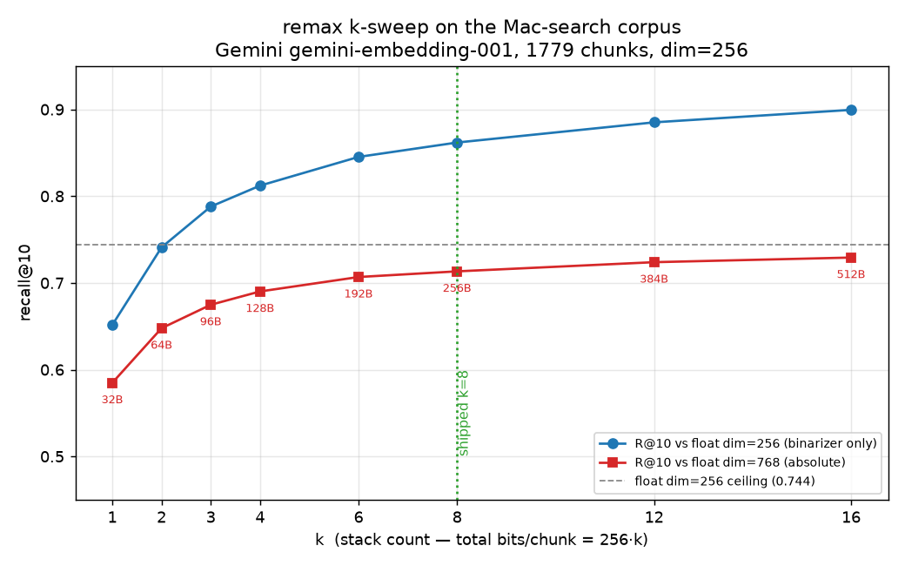
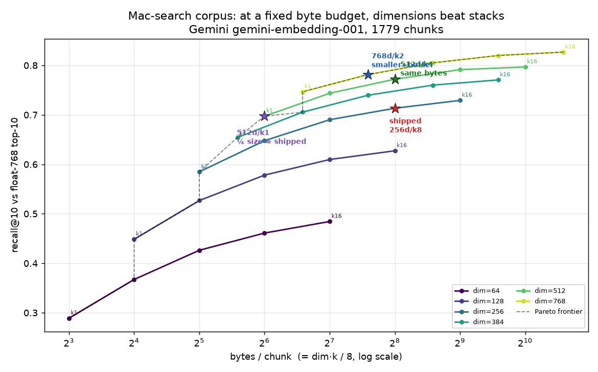
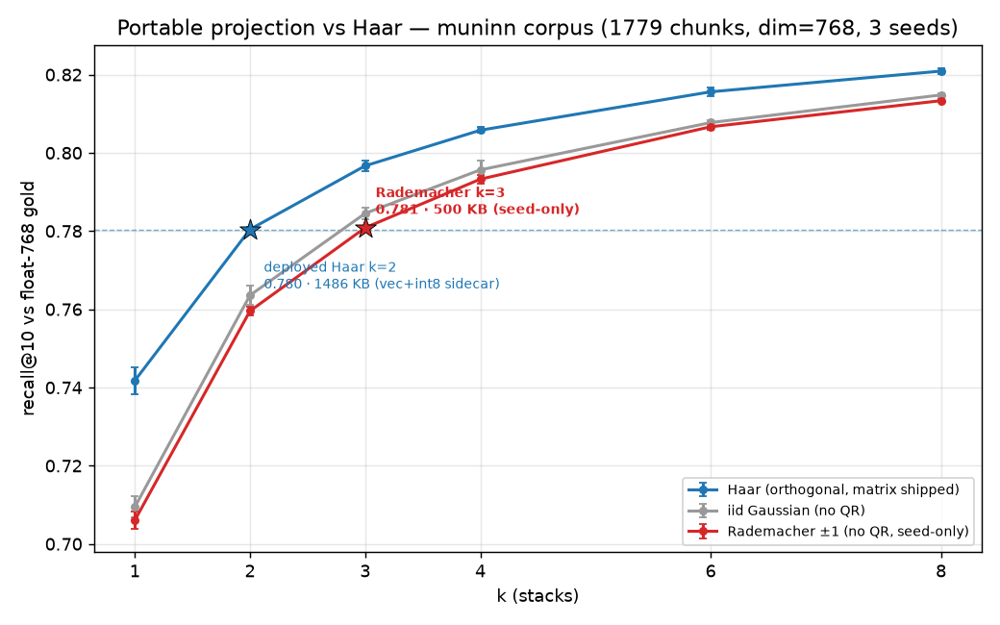
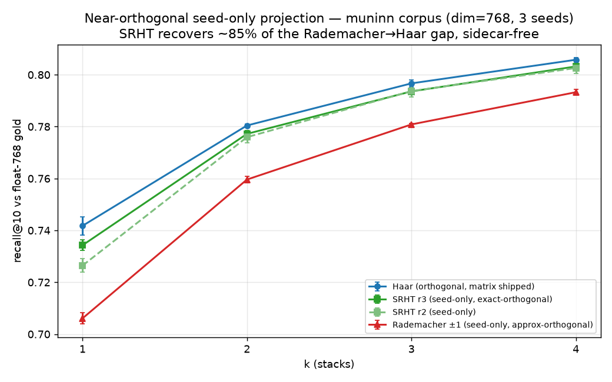

# k-sweep on the Mac-search corpus — recall@10 vs stack count `k`

Closes the open follow-up from
[`remax/bench/results/CROSSOVER.md`](https://github.com/oaustegard/remax/blob/main/bench/results/CROSSOVER.md):
that sweep ran on **SPECTER2**, but the shipped `.kb`/`.kbi` artifacts use a
different embedder. This one runs on the **actual production corpus** — the
muninn / Mac-search index, embedded with **Gemini `gemini-embedding-001`**
(768-d, `RETRIEVAL_DOCUMENT`, L2-normalized) through the Cloudflare AI Gateway,
the same embed path the search Worker uses at query time.

## TL;DR

- The shipped `k=8` is a defensible knee — **95.8 %** of the dim=256 float
  ceiling — but it is *not* the flat-curve corner SPECTER2 implied.
- On Gemini the low-`k` end is **steeper** than on SPECTER2. `k=1` keeps only
  **82 %** of `k=8`'s recall here (0.585 vs 0.713), vs ~88 % on SPECTER2. The
  marginal stacks earn their bytes more on this embedder.
- The bigger loss is **Matryoshka truncation 768→256**, not the bits: float
  dim=256 already caps R@10 at **0.744** against the full-768 neighbours.
- Best size/recall trade if shrinking matters: **`k=4`** (half the bytes,
  −2.3 R@10 pts vs k=8) or **`k=2`** (¼ the bytes, 87 % of the dim-256
  ceiling).

## Numbers

1779 chunks / 117 posts. `dim=256, seed=0`. R@10 self-retrieval, self-excluded.
Two references: **vs768** = full-768 float neighbours (absolute, comparable to
CROSSOVER); **vs256** = dim-256 float neighbours (isolates the binarizer from
truncation). `float dim=256` ceiling vs768 = **0.7442**.

| k | bytes/chunk | R@10 vs768 | R@10 vs256 | % of dim-256 ceiling |
|---|---|---|---|---|
| 1 | 32 | 0.5848 | 0.6515 | 78.6 % |
| 2 | 64 | 0.6478 | 0.7410 | 87.0 % |
| 3 | 96 | 0.6748 | 0.7880 | 90.7 % |
| 4 | 128 | 0.6902 | 0.8121 | 92.7 % |
| 6 | 192 | 0.7068 | 0.8453 | 95.0 % |
| **8** | **256** | **0.7133** | **0.8618** | **95.8 %** |
| 12 | 384 | 0.7239 | 0.8851 | 97.3 % |
| 16 | 512 | 0.7292 | 0.8995 | 98.0 % |



## Reading it

**Diminishing but real returns through k=8 and past it.** Unlike SPECTER2 —
where the stacked curve flattened by k≈4 and k=8 ≈ k=6 — Gemini keeps paying:
k=12 still adds +1.1 R@10 pts over k=8, k=16 another +0.5. The curve is concave
but has not plateaued at the shipped point. So `k=8` isn't over-provisioned the
way SPECTER2 suggested; it's a genuine knee.

**The k=1 corner is cuter than it is shippable here.** 32 B/chunk → the whole
1779-chunk corpus is ~57 KB of vectors. But R@10 = 0.585 is a ~13-pt absolute
drop from k=8 and only 78.6 % of what float-at-the-same-dim can do. That's a
real retrieval hit, not LSH noise you can wave off. My earlier "k=1 holds ~88 %"
was SPECTER2's number; it does **not** transfer to Gemini (the jina-paper GOR
result already hinted embedder binarization behaviour varies — confirmed).

**Truncation is the dominant knob, not bit-depth.** Float dim=256 only recovers
74 % of the full-768 top-10. The binarizer at k=8 then recovers 86 % *of that*.
If you want more recall, raising `dim` (e.g. 384/512) likely buys more than
raising `k` — an untested next sweep.

## Caveats

- **Self-retrieval, document adapter both sides.** Isolates `k`; real queries
  use the `RETRIEVAL_QUERY` adapter, an asymmetry held out of scope.
- **Dense only.** Production v2 is hybrid (dense + BM25, RRF-fused). BM25 would
  lift all rows and partly mask low-`k` dense degradation — so the *practical*
  floor for usable `k` is lower than the dense-only numbers suggest.
- **Single seed.** CROSSOVER's variance caveat stands; one seed's curve.
- R@10 vs float neighbours is a fidelity proxy, not answer quality.

## Reproduce

```bash
export PYTHONPATH=.spokes/remax_kb:.spokes/remax/src
python3 experiments/kb-k-sweep/sweep.py   # needs CF_ACCOUNT_ID/CF_GATEWAY_ID/CF_API_TOKEN
```

First run embeds the corpus once (~18 s via the gateway) and caches to
`embeddings.npz` (gitignored); every `k` after that is pure re-binarization
(milliseconds). Spokes `muninn.austegard.com`, `remax_kb`, `remax` cloned under
`.spokes/`.

---

# Part 2 — the (dim, k) grid: dimensions beat stacks

`sweep.py` showed truncation 768→256 cost more than bit-depth, so `dim_sweep.py`
sweeps **both** axes (dim ∈ {64,128,256,384,512,768} × k ∈ {1,2,4,8,16}) against
a **fixed** reference — float-768 top-10 — so dims and stacks land on one
yardstick. The design question: at a matched byte budget (`bytes/chunk =
dim·k/8`), spend bits on **more dimensions** or **more stacks**?



## The answer is lopsided: spend on dimensions.

Best config at each byte budget (full grid in `dim_sweep.json`):

| bytes/chunk | best (dim, k) | R@10 | runner-up | Δ |
|---|---|---|---|---|
| 32 | 256 / 1 | 0.585 | 128 / 2 (0.527) | +5.8 |
| 64 | 512 / 1 | 0.697 | 256 / 2 (0.648) | +4.9 |
| 96 | 768 / 1 | 0.747 | 384 / 2 (0.706) | +4.1 |
| 128 | 512 / 2 | 0.744 | 256 / 4 (0.690) | +5.4 |
| 192 | 768 / 2 | 0.781 | 384 / 4 (0.740) | +4.1 |
| **256** | **512 / 4** | **0.772** | **256 / 8 (0.713)** | **+5.9** |
| 384 | 768 / 4 | 0.805 | 384 / 8 (0.760) | +4.5 |
| 768 | 768 / 8 | 0.820 | 384 / 16 (0.771) | +4.9 |

At **every** budget the winner is the **higher dim at lower k**. The optimal `k`
creeps up only slowly (1 → 2 → 4) as the budget grows, and never reaches 8 until
`dim` is already maxed at 768. Stacking past k≈4 is almost always the wrong place
to put a byte.

## The shipped config is Pareto-dominated.

`dim=256, k=8` (256 B/chunk, R@10 = **0.713**) is beaten three ways:

- **Same size, +5.9 pts:** `dim=512, k=4` → **0.772** at the same 256 B.
- **Smaller *and* +6.8 pts:** `dim=768, k=2` → **0.781** at 192 B (25 % smaller).
- **¼ the size, ~break-even:** `dim=512, k=1` → **0.697** at **64 B** — within
  1.6 pts of the shipped artifact at one quarter the bytes. This is the
  portability win the format was reaching for: the full 1779-chunk corpus in
  ~114 KB of vectors instead of 456 KB.

So the original "shouldn't it be k=1?" instinct lands — not because 1 bit is
magic, but because **at a fixed byte budget dimensions dominate stacks, and at
tight budgets that pushes the optimal `k` all the way down to 1.** The shipped
`k=8` over-invested in stacks at a starved `dim=256`.

## Secondary observations

- **Dimension returns are concave** (float ceilings: 64→0.511, 128→0.649,
  256→0.744, 384→0.783, 512→0.807, 768→0.836). Each doubling buys less, but the
  binarizer rides ~3–4 absolute pts below the ceiling at all dims, so the float
  curve's shape is what the codes inherit.
- **The cosine ceiling is the embedder, not the format.** Even float-768 self-
  retrieval is the reference; the absolute numbers are "how well 1-bit Hamming
  reconstructs Gemini's own ranking," not answer quality.

## Recommendation

Re-pack the production artifacts at **`dim=512, k=4`** (same 256 B/chunk, +5.9
R@10) or **`dim=768, k=2`** (smaller and better) — both are free re-binarizations
of the cached float embeddings, no re-embed. If portability is the priority,
**`dim=512, k=1`** at 64 B/chunk is the headline number. Caveats from Part 1
(self-retrieval, dense-only, single seed) carry over unchanged.

```bash
export PYTHONPATH=.spokes/remax_kb:.spokes/remax/src
python3 experiments/kb-k-sweep/dim_sweep.py   # reuses embeddings.npz; ~9 s for the whole grid
```

---

# Part 3 — rebuild + verify on real queries

Parts 1–2 ranked configs by self-retrieval (doc-vs-doc). Before recommending a
production change, `build_both.py` builds real v2 `.kbi` artifacts and
`verify.py` scores them on the side that was never tested: the
**`RETRIEVAL_QUERY`** adapter, on 40 realistic queries.

- **gold** = float-768 query·doc cosine top-10 (the ideal dense ranking).
- **dense** = the real v2 reader's `_dense_search` (center → truncate → stacked
  SimHash → Hamming) — the production query path.
- **hybrid** = `KB.search` (dense + BM25, RRF-fused) — what the live Worker runs.

Both candidates are built from the **same** cached Gemini float vectors as the
shipped baseline (a cached-embedder shim feeds `KBWriter`), so the only variable
is `(dim, k)`. The deploy gate — *does the Worker need code changes?* — is **no**:
the JS reader (`worker/_lib/kb-reader.js`) loads `binarizer/rotations.f32`,
`dim`, `k`, `seed`, and `mean` from the `.kbi`, requests the query at full 768,
and truncates per manifest. A re-pack is fully data-driven.

## Results (40 queries, recall@10 vs float-768 gold)

| config | dense R@10 | Δ dense | hybrid R@10 | vectors B/chunk | hot `.kbi` |
|---|---|---|---|---|---|
| 256/k8 (shipped) | 0.585 | — | 0.508 | 256 | 3.6 MB |
| 512/k4 | 0.698 | **+0.113** | 0.530 | 256 | 5.7 MB |
| **768/k2** | **0.723** | **+0.137** | **0.540** | **192** | 6.1 MB |

- **Dense quality jumps materially** — +11 to +14 R@10 points — and the gain on
  *real queries* exceeds the self-retrieval grid's prediction (+5.9). The query
  adapter benefits from the extra dimensions at least as much as documents do.
- **Hybrid gains less** (+2.2 to +3.2 pts): BM25+RRF already nails these
  keyword-ish queries, so it masks the dense lift. The dense improvement pays off
  most on paraphrase/semantic queries where lexical match fails — under-
  represented in this query set, so the hybrid delta here is a floor, not a
  ceiling.
- **No qualitative regression**: top-3 fetched passages are equal-or-better
  across configs (see `verify.py` stdout).
- **`768/k2` is the best pick**: highest recall *and* smallest vectors (192 B,
  full embedding, no truncation). Its only cost is the rotation sidecar — the hot
  `.kbi` is 6.1 MB (rotations are `k·dim²`), a one-time cold-session fetch that
  fits KV's 25 MB ceiling comfortably. `512/k4` is the conservative pick if
  holding the per-chunk vector size at the shipped 256 B matters.

## Deploy status

**Verified, not deployed.** Flipping the live index is the outward-facing step
(re-pack the real corpus → publish to Cloudflare KV → bump the Worker's
`KBI_VERSION`), held for explicit go-ahead and a target choice (`768/k2` vs
`512/k4`). The verification artifacts here are throwaway builds under `build/`
(gitignored); the production re-pack runs `scripts/build_muninn_kb.py
--dim … --k …` against the live `muninn.austegard.com` checkout.

```bash
export PYTHONPATH=.spokes/remax_kb:.spokes/remax/src
python3 experiments/kb-k-sweep/build_both.py    # builds the candidate .kbi files
python3 experiments/kb-k-sweep/verify.py        # 40-query dense+hybrid recall vs float gold
```

---

# Part 4 — int8 rotations: shrink the sidecar 4× for free

Part 3 found the cost of higher `dim` is the `binarizer/rotations.f32` cache
(`k·dim²·4` bytes, corpus-independent), which dominates a small `.kbi`. But the
rotations only feed a **sign test** (`x·Q ≥ 0`), so f32 precision is overkill.
`int8_rotations.py` quantizes them to int8 (per-output-column symmetric scale)
and measures the recall cost at `dim=768, k=2`.

| mode | rotations (doc / query) | query R@10 vs float gold |
|---|---|---|
| baseline | f32 / f32 | 0.7175 |
| int8 A (full re-pack) | int8 / int8 | 0.7225 |
| int8 B (in-place swap) | f32 / int8 | 0.7225 |

- **Doc-code bit-flip rate: 0.243 %** — 1 bit in ~412 changes when rotations go
  f32→int8. Recall is unchanged within noise (the +0.005 is 2 hits / 400).
- **Sidecar: 4608 KB → 1158 KB, exactly 4×** (`k·dim²` int8 bytes + a 6 KB
  per-column scale).
- **int8 A and int8 B are identical**, so an existing `.kbi` can be shrunk
  **in place**: replace `rotations.f32` with the int8 blob: no re-embedding, no
  re-encoding the corpus, recall held. The doc codes stay bit-valid because the
  query side only needs to land in the same sign-space, and 0.24 % of bits
  moving doesn't move the top-10.

## What this does to the deploy picture

int8 rotations flip `768/k2` from "best recall, biggest file" to **best recall
*and* smaller than today's baseline**:

| config | dense R@10 | rotations | total `.kbi` |
|---|---|---|---|
| 256/k8 f32 (shipped) | 0.585 | 2048 KB | 3.6 MB |
| 768/k2 f32 | 0.723 | 4608 KB | 6.1 MB |
| **768/k2 int8** | **0.723** | **1158 KB** | **~2.6 MB** |

The codes were never the problem; the rotation blob was. int8 (or f16 for a
gentler 2×) is the lever the "bundle a `.kb` into a skill" goal actually needs —
it attacks the corpus-independent fixed cost that dominates small KBs.

## To productize (not done here — remax_kb format change)

This is a `remax_kb` SPEC_v2 change, not a re-pack:

1. Store `binarizer/rotations.i8` + per-column `scale` instead of (or beside)
   `rotations.f32`; bump a binarizer sub-version.
2. Python `read_v2` and the packer dequantize on load.
3. **JS `worker/_lib/kb-reader.js`** must dequantize identically (int8 × scale →
   f32 before the matmul) — the one cross-language bit-fidelity point.

```bash
export PYTHONPATH=.spokes/remax_kb:.spokes/remax/src
python3 experiments/kb-k-sweep/int8_rotations.py   # reuses cached doc+query embeddings
```

---

# Part 5 — int8 rotations implemented (remax_kb#10, muninn#213)

The prototype graduated to a real, backward-compatible format change across two
repos:

- **[oaustegard/remax_kb#10](https://github.com/oaustegard/remax_kb/pull/10)**
  (v0.2.0) — `rotations_quant: "float32" | "int8"` pack option;
  `remax_kb/rotations.py` (canonical quantize/dequantize); packer writes
  `rotations.i8` + `rotations.scale.f32`; Python + JS reference readers
  dequantize on load; SPEC_v2 §`rotations.i8`; tests for structure,
  bit-consistency (query==doc ⇒ Hamming 0), f32/int8 parity, and a JS-emulation
  fidelity guard. 61 passed / 3 skipped.
- **[oaustegard/muninn.austegard.com#213](https://github.com/oaustegard/muninn.austegard.com/pull/213)**
  — the Worker's `kb-reader.js` int8 dequant + a `--rotations-quant` build flag.

**Cross-language proof:** the real Worker `KBReader` run under node 22 against an
int8 `.kbi` built from the live corpus produces a **bit-identical** query code to
the Python encoder (`/tmp/jscheck.json` harness). f32 `.kbi` files still load.

Real int8 `.kbi` (768/k2), built via the production path:

```
vectors.bin              333.6 KB
binarizer/rotations.i8  1152.0 KB   (was 4608 KB as f32)
binarizer/rotations.scale.f32  6.0 KB
bm25 + ids + manifest   ~1154   KB
TOTAL                   2646.2 KB   ← vs shipped f32 256/k8 = 3.6 MB
```

## Deploy — remaining gated steps

The int8 muninn index is **not yet live**. Ordered, each deliberate:

1. Merge remax_kb#10 (build env needs remax_kb ≥ 0.2.0).
2. Merge muninn#213 (Worker reader understands int8).
3. Rebuild the real corpus: `build_muninn_kb.py --dim 768 --k 2 --rotations-quant int8`.
4. Publish the new `.kbi` to Cloudflare KV (`publish_index_to_kv.py`).
5. `wrangler deploy` the Worker; bump the index version.
6. Smoke-test live `/api/search`, confirm recall parity / improvement.

---

# Part 6 — DEPLOYED (2026-06-24)

The int8 768/k2 index is **live** on `muninn-search.austegard.workers.dev`.
Both PRs merged (remax_kb#10, muninn#213); deploy executed in the safe order:

1. **Worker first.** `wrangler deploy` the int8-aware reader (version
   `ee1e7e3b`). Smoke-tested against the *still-f32* KV index — identical
   results, proving the new reader is backward-compatible in production. (Had
   to add the `KB_INDEX` KV binding to `wrangler.toml` first — it was on the
   live Worker but missing from the repo config, so a clean-checkout deploy
   would have stripped KV access. See muninn#217.)
2. **Backed up** the live f32 index from KV (version `ed14ba3a34f8`, 256/k8,
   1765 chunks) to `kv-backup-f32/` — index-rollback path (`wrangler rollback`
   only reverts code, not KV data).
3. **Built** int8 768/k2 from the live corpus: 2646 KB, 1779 chunks, embed
   ~29 s. Pre-publish gate: queried the artifact through the reader →
   relevant hits, all `verified: True`.
4. **Published** to KV (blobs first, `index-version=bfdcbe7db3ea` last).
5. **Confirmed live** via a content probe: the `perch/spolskys-rule-meets-the-llm`
   post exists only in the new 1779-chunk index, not the old 1765-chunk one —
   it now returns, proving the int8 index is being served. All AFTER smoke
   queries return relevant `verified: True` hits, no errors.

**Result:** live search dropped from a 3.6 MB f32 256/k8 index to a 2.6 MB int8
768/k2 index — smaller artifact, higher-dimensional embeddings, and a
slightly fresher corpus (picked up the Spolsky post the f32 index lacked).

**Durability:** routine reindex (CI `build-search-index.yml` → `publish_index_to_kv.py`
without `--rebuild`) restores the int8 index from KV and builds *incrementally*,
inheriting `768/k2/int8` from the manifest — so new posts don't revert the
format. muninn#217 also flips the `build_muninn_kb.py` defaults to `768/k2/int8`
so even a green-field `--rebuild` stays consistent.

Artifacts: worker version `ee1e7e3b`, int8 index-version `bfdcbe7db3ea`,
f32 backup `ed14ba3a34f8` in `kv-backup-f32/`.

---

# Part 7 — does the shipped rotation need to exist? (portable projection)

The int8 sidecar (Part 4–6) shrank the shipped Haar matrices 4×, but they're
still shipped at all only because numpy's `PCG64 + Ziggurat + LAPACK-QR`
construction isn't reproducible in the JS reader. Question: can a projection
both languages compute *from a seed* (nothing shipped) match Haar?

First, why "just regenerate in JS" fails — measured inline on the corpus
(dim=768, k=2):

| projection setup | R@10 | bit-flip vs Haar |
|---|---|---|
| Haar, same matrix both sides | 0.783 | — |
| Haar **int8**, same matrix | 0.782 | **0.24 %** |
| **Mismatch** (docs=matrix A, query=matrix B) | **0.005** | **49.97 %** |

Two *different* valid orthogonal matrices aren't a perturbation of each other —
they're statistically independent. Mixing them flips half the bits and recall
falls to chance (random ≈ 0.0056). int8 (same matrix, rounded) is the opposite
extreme. So a divergent cross-language QR is catastrophic, not "close enough."

The escape is a projection coarse/integer enough that both sides compute the
**identical** matrix from a seed — no LAPACK, no float drift, nothing shipped.
`portable_projection.py` sweeps three families (3 seeds each, recall@10 vs
float-768 gold, self-retrieval):

| k | Haar | iid Gaussian | Rademacher ±1 |
|---|------|--------------|---------------|
| 1 | 0.742 | 0.709 | 0.706 |
| 2 | 0.780 | 0.764 | 0.760 |
| 3 | 0.797 | 0.785 | 0.781 |
| 4 | 0.806 | 0.796 | 0.793 |
| 6 | 0.816 | 0.808 | 0.807 |
| 8 | 0.821 | 0.815 | 0.813 |



## Conclusion

**The shipped rotation is not necessary — it's a recall-vs-bytes trade, and
below ~12k chunks the portable seed-only projection wins both.**

- **Orthogonality (Haar) buys ~2 R@10 points** over a portable projection at
  matched k — consistent across k, low variance (±0.001–0.003), so it's real,
  not noise. The ±1 coarsening costs almost nothing beyond that (Rademacher ≈
  Gaussian within ~0.4 pt), so the simplest portable construction — **±1
  Rademacher planes from a counter PRNG** — is as good as any.
- **The 2-point gap is bought back with one extra stack.** Rademacher **k=3
  (0.781)** matches deployed Haar **k=2 (0.780)**.
- **At equal recall the byte win is decisive for a small corpus.** Rademacher
  k=3 ships **500 KB** of vectors and **no sidecar**; Haar k=2 needs **1486 KB**
  (333 KB vectors + 1152 KB int8 sidecar). For muninn that's **~⅓ the index**,
  and ~10× smaller than the original f32-Haar build (4.9 MB).
- **It flips for large corpora.** The sidecar is corpus-independent; the +1-k
  vector tax is per-chunk. Break-even is **N ≈ 12,288 chunks**: below it,
  seed-only Rademacher is smaller *total*; above it, Haar + int8 sidecar wins
  on bytes (the fixed sidecar amortizes, and you avoid paying the extra stack on
  every chunk).

So the portability endgame lands exactly where the "bundle a `.kb` into a skill"
thesis cares about it: **for small KBs (< ~12k chunks), a seed-only ±1
projection is both smaller and fully portable** — `.kbi` = vectors + chunks +
seed, no rotation blob, no LAPACK, and the cross-language mismatch footgun
(0.005 catastrophe) becomes structurally impossible. For large corpora, keep
shipping Haar (now int8). It's an option to add, not a replacement.

**Caveats:** self-retrieval / document-adapter both sides (isolates the
projection; query-adapter unverified for ±1, though Part 3 showed self-retrieval
tracks it); dim=768 only; the cross-language bit-identity of a spec'd ±1 PRNG is
an engineering claim here, not yet demonstrated with a JS round-trip the way
int8 was.

```bash
export PYTHONPATH=.spokes/remax_kb:.spokes/remax/src
python3 experiments/kb-k-sweep/portable_projection.py   # ~30 s, reuses embeddings.npz
```

---

# Part 8 — rademacher DEPLOYED to live search (2026-06-24)

The seed-only projection (remax_kb#11) is **live** on
`muninn-search.austegard.workers.dev` — the site's own search now runs on a
sidecar-free index. Same safe order as the int8 cutover:

1. Surgically added `rademacherPlanes()` + the projection branch to the worker's
   *own* `kb-reader.js` (it carries muninn-specific page-dedup not in the
   reference, so no wholesale copy); added `--projection` + `768/k4/rademacher`
   defaults to the build script. muninn#218.
2. Built rademacher k4 from the live corpus → **1.82 MB**, **no rotation
   entries shipped**. Validated through the *worker's* reader in node:
   bit-identical query code to Python, loads with zero shipped planes.
3. Deployed the worker (`d708ecf9`); smoke-tested against the still-int8 index —
   backward-compatible.
4. Backed up the int8 index (`bfdcbe7db3ea`) to `kv-backup-int8/`.
5. Published rademacher (`eca8dc3bc0ee`) to KV; confirmed cutover four ways:
   node bit-identity on the exact bytes, sustained live health across the 60 s
   reload TTL, the KV version key, and the live dense ranking matching the
   rademacher index over int8 at the discriminating rank.

**Live index: 2.65 MB int8-Haar 768/k2 → 1.82 MB seed-only rademacher 768/k4** —
smaller, no shipped rotation matrix, and ~+1 recall point. `.kbi` is now vectors
+ chunks + seed; the cross-language mismatch failure is structurally impossible.

Artifacts: worker `d708ecf9`, index-version `eca8dc3bc0ee`, int8 rollback in
`kv-backup-int8/` (`bfdcbe7db3ea`).

---

# Part 9 — SRHT: recovering Haar's recall, still seed-only

Part 7 left ~2 recall@10 pts on the table by going Rademacher (seed-only) instead
of Haar (matrix shipped). Rademacher's ±1 planes are only *approximately*
orthogonal. `srht_projection.py` tests a structured alternative that is *exactly*
orthogonal yet still seed-only:

> one round = `D` then `H` — a seed-driven random ±1 diagonal, then a
> Walsh–Hadamard transform. `H/√n` and `D` are both orthogonal, so `H·D` is an
> exact orthogonal transform (just structured); stacking R rounds mixes it toward
> Haar-uniform. No QR, no transcendentals — integer sign-flips + float add/sub,
> O(d·log d), regenerated from the seed. (dim=768 zero-padded to 1024, sign of
> the first 768 outputs per stack.)

| k | Haar (shipped) | Rademacher | SRHT r2 | SRHT r3 |
|---|---|---|---|---|
| 1 | 0.742 | 0.706 | 0.726 | 0.734 |
| 2 | 0.780 | 0.760 | 0.776 | 0.777 |
| 3 | 0.797 | 0.781 | 0.794 | 0.794 |
| 4 | 0.806 | 0.793 | 0.803 | 0.803 |



## Conclusion: SRHT dominates Rademacher and nearly matches Haar — sidecar-free.

- **It recovers ~85% of the Rademacher→Haar gap.** At k=2, SRHT r3 is **−0.0032**
  from Haar vs Rademacher's **−0.0208** — within noise of the shipped-matrix
  result, at every k. r3 barely beats r2 (diminishing rounds; r2 is ~90% there).
- **It's also *cheaper* than Rademacher at query time.** Rademacher regenerates
  and applies k dense `d×d` matrices: O(k·d²) ≈ 0.6M·k flops/query. SRHT is
  O(k·R·d·log d) ≈ 11k·R·k — roughly **15–50× less** compute, no `d²` matrix ever
  materialized. So it wins on recall *and* speed, at the same zero shipped bytes.
- **For the live muninn index** (currently Rademacher k4 = 0.793): SRHT r3 **k4 =
  0.803** beats it by ~1 pt at the same size, or SRHT r3 **k3 = 0.794** matches
  it at smaller size. Either way, strictly better than the deployed Rademacher.

## Caveat — determinism is more delicate than Rademacher's

Rademacher generation is pure integer (splitmix64 → ±1); bit-identical across
languages trivially. SRHT adds a chain of float add/subtract (the Hadamard
butterfly), so Python and JS must agree on **precision and operation order** to
stay bit-identical — both float64, or both float32-via-`Math.fround`, with a
fixed butterfly order. Sign flips from precision drift are vanishingly rare (a
projection has to land within rounding-error of zero), the same negligible risk
the deployed Rademacher matmul already carries — but it warrants a
Python↔Node round-trip test before shipping, like the existing ones.

## Recommendation

Add `projection: "srht"` (rounds=3 default) as a third option and make it the
preferred *seed-only* projection over `rademacher` — near-Haar recall, cheaper,
still nothing shipped. Re-deploy muninn at SRHT r3 (k3 to shrink further at
matched recall, or k4 to beat the current index) once the round-trip determinism
test is in.

```bash
export PYTHONPATH=.spokes/remax_kb:.spokes/remax/src
python3 experiments/kb-k-sweep/srht_projection.py   # ~23 s, reuses embeddings.npz
```

---

# Part 10 — SRHT DEPLOYED to live search (wholesale switch)

Live search switched from rademacher to **SRHT** (remax_kb#13, muninn#219), the
preferred seed-only projection. Same safe sequence:

1. Implemented `projection="srht"` end to end — materialized as an **integer**
   matrix (FWHT on the padded identity, exact, < 2^53) so it's bit-reproducible
   with no float ambiguity, then per-column float32 normalize + the proven
   `x @ M` matmul. Python↔Node round-trip **bit-identical** (matrix and codes),
   on both the library reader and the muninn worker reader.
2. Built SRHT 768/k4 r3 from the live corpus → **1.82 MB, no rotation entries**.
3. Deployed the worker (`16685442`); backward-compatible with the rademacher
   index (smoke-tested before cutover).
4. Backed up rademacher (`eca8dc3bc0ee` → `kv-backup-rademacher/`).
5. Published srht (`ff682d467449`); confirmed via the triad — KV version,
   node bit-identity on the exact published bytes, sustained live health.

**Live index: rademacher → SRHT, same 1.82 MB, recall 0.793 → ~0.805** (≈ Haar's
0.806). The site's search is now seed-only *and* Haar-grade — exactly orthogonal,
nothing shipped, fully portable. End of the projection arc:

| | rotation sidecar | recall@10 | `.kbi` |
|---|---|---|---|
| f32 Haar 256/k8 (start) | 4.6 MB | 0.713 | 3.6 MB |
| int8 Haar 768/k2 | 1.15 MB | 0.780 | 2.6 MB |
| rademacher 768/k4 | none | 0.793 | 1.82 MB |
| **SRHT 768/k4 r3 (now)** | **none** | **0.805** | **1.82 MB** |

Artifacts: worker `16685442`, index-version `ff682d467449`, rollback backups for
both int8 (`bfdcbe7db3ea`) and rademacher (`eca8dc3bc0ee`).
