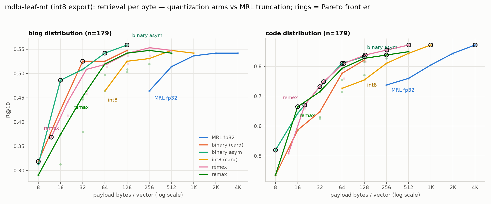

# MongoDB/mdbr-leaf-mt as a remax_kb embedder

Run 2026-08-16. Box: **4 vCPU / 15 GB** (CCotw) — same class as
[`bekko-embedding-bench`](../bekko-embedding-bench/RESULTS.md) (2026-08-04),
whose harness, corpora, and incumbents this reuses. Model:
[MongoDB/mdbr-leaf-mt](https://huggingface.co/MongoDB/mdbr-leaf-mt) — 23M
params (BERT 6 layers × 384 hidden × 1536 FFN, mean-pool + Dense 384→1024),
1024-d, MRL-trained, distilled from `mxbai-embed-large-v1`, and **#1 on MTEB
v2 (Eng) for models ≤30M** at the time of the card.

**Headline.**

- **No swap of the remax_kb default.** jina v5 nano q4 beats leaf-mt on both
  distributions, decisively on code: **R@1 0.888 vs 0.581 (Δ −0.307, 2 wins /
  57 losses, p < 1e-5)** — the same cell that settled the bekko verdict, with
  nearly the same margin. Blog R@10 −0.067 (p = 0.036). The MTEB-#1-for-size
  billing does not transfer to these corpora.
- **The compute-bound rung is where it lands.** leaf-mt's **int8 export
  (23.7 MB)** is a paired **statistical tie with bekko-a8m** in all four cells
  measured, at **5.2x smaller artifact** and **8.0 vs 10.8 ms** same-session
  1-thread query. If the constraint is artifact size rather than quality,
  leaf-mt-int8 now holds that rung; if it is quality, jina still holds the top.
- **The int8 export is the one to use.** Unlike bekko, whose transformer-int8
  exports ship `_not_recommended`, leaf's `model_quantized.onnx` is *faster
  than its own fp32* (7–8 vs 15 ms query, 1.9x docs/s) with no significant
  retrieval cost (blog −0.022 p=0.29, code +0.006; per-doc cosine 0.989 vs
  fp32). The q4 export is strictly worse here: slower than fp32 at 1 thread
  *and* the only export with a directional code-quality dip (−0.028, n.s.).

## Method

Part B of the bench family only: self-retrieval, head (180 chars) as query,
body as indexed doc with the head removed, gold = diagonal. Two distributions:
the 179-chunk muninn blog subset (chunks read from the committed
`bench_bekko-a8m.kb`, no external fetch) and a 179-chunk sklearn AST slice.
The sklearn corpus rebuilt at commit `7cb1868aa` (last before 2026-08-05)
reproduces the prior run exactly — **11,380 AST chunks over 674 files**, same
counts — and jina's recomputed numbers (blog 0.631 / code 0.978 R@10) match
the 2026-08-04 aggregates to the third decimal, so cross-run comparisons
against that file's tables are sound. jina and bekko-a8m were **re-encoded on
the same splits** here, so every verdict below is paired per query (exact
McNemar + paired bootstrap CI), not read off old aggregates.

The shipped ONNX graphs export a `sentence_embedding` (B, 1024) output with
pooling and the Dense projection baked in; the encoder here reproduces it
from `last_hidden_state` by hand (cos = 1.000 agreement) so the same code
path serves all three exports. Prefixes per the card: queries get
`"Represent this sentence for searching relevant passages: "`, documents none.

## Retrieval — R@10 (R@1), full width

| model | dim | MB | blog | code |
|---|---|---|---|---|
| jina v5 nano q4 (incumbent) | 768 | 131.6 | **0.631** (0.274) | **0.978** (0.888) |
| bekko-a8m (paired rerun) | 384 | 124.1 | 0.575 (0.212) | 0.888 (0.665) |
| leaf-mt fp32 | 1024 | 89.1 | 0.564 (0.268) | 0.866 (0.581) |
| **leaf-mt int8** | 1024 | **23.7** | 0.542 (0.251) | 0.872 (0.592) |
| leaf-mt q4 | 1024 | 53.7 | 0.564 (0.257) | 0.838 (0.508) |

MRL curve (fp32, R@10): blog 0.564 → 0.564 → 0.559 → 0.542 → 0.531 → 0.486
and code 0.866 → 0.832 → 0.827 → 0.816 → 0.754 → 0.698 across
1024/512/384/256/128/64. Truncation degrades smoothly, as the card claims —
but at **every** shared dim leaf sits below jina *and* below bekko-a25m, and
at iso-byte budgets the gap widens (leaf@256 vs jina@256, code: −0.168,
p < 1e-5; leaf@64 vs jina@64, code: −0.251, p < 1e-5).

## Paired significance (n=179 per distribution)

| comparison | Δ | 95% CI | w/l | p | verdict |
|---|---|---|---|---|---|
| leaf fp32 vs jina, code R@1 | **−0.307** | [−0.380, −0.235] | 2/57 | **<1e-5** | **jina, decisive** |
| leaf fp32 vs jina, code R@10 | −0.112 | [−0.162, −0.067] | 1/21 | **<1e-4** | jina |
| leaf fp32 vs jina, blog R@10 | −0.067 | [−0.123, −0.011] | 8/20 | **0.036** | jina |
| leaf fp32 vs jina, blog R@1 | −0.006 | [−0.061, +0.050] | 12/13 | 1.000 | noise |
| leaf int8 vs bekko-a8m, blog R@10 | −0.034 | [−0.095, +0.028] | 12/18 | 0.362 | noise |
| leaf int8 vs bekko-a8m, code R@10 | −0.017 | [−0.061, +0.028] | 8/11 | 0.648 | noise |
| leaf int8 vs bekko-a8m, blog R@1 | +0.039 | [−0.017, +0.095] | 17/10 | 0.248 | noise |
| leaf int8 vs bekko-a8m, code R@1 | −0.073 | [−0.145, +0.000] | 17/30 | 0.079 | leans bekko, unresolved |
| leaf int8 vs leaf fp32, blog R@10 | −0.022 | [−0.056, +0.006] | 2/6 | 0.289 | noise |
| leaf q4 vs leaf fp32, code R@10 | −0.028 | [−0.067, +0.011] | 4/9 | 0.267 | noise |

Same power caveats as the parent bench: one query is 0.56 pp, and only gaps
of roughly 0.07+ with lopsided discordant counts resolve at this n. The
jina-vs-leaf code cells clear that bar overwhelmingly; nothing between leaf
and bekko does.

## Compute — median of 5, each model's own tokenizer and prefixes

| threads | model | query (batch=1) | docs/s | tokens/s | MB |
|---|---|---|---|---|---|
| 1 | **leaf-mt-int8** | **7.3 ms** | **80.1** | **9,055** | **23.7** |
| 1 | leaf-mt-fp32 | 15.4 ms | 42.4 | 4,792 | 89.1 |
| 1 | leaf-mt-q4 | 18.3 ms | 30.3 | 3,419 | 53.7 |
| 1 | jina v5 nano q4 | 140.0 ms | 5.5 | 592 | 131.6 |
| 4 | leaf-mt-int8 | 9.1 ms | 74.1 | 8,370 | |
| 4 | leaf-mt-fp32 | 9.1 ms | 60.1 | 6,797 | |
| 4 | leaf-mt-q4 | 7.6 ms | 50.0 | 5,649 | |
| 4 | jina v5 nano q4 | 39.9 ms | 17.5 | 1,893 | |

leaf-mt-int8 is **19.2x faster per query than jina on 1 vCPU** and 15.3x the
throughput. The leaf query prompt costs 10 tokens of its 48-token queries —
the prefix is a real part of the price and is charged here. Same-session
against bekko-a8m: 8.0 vs 10.8 ms (1.35x), consistent with the FLOPs ratio
(6×384×1536 vs 4×384×1152 favors bekko per layer count, but leaf's int8
transformer beats bekko's fp32-transformer/int8-table split).

Note the 1-thread inversion: leaf's q4 export is *slower* than fp32
(18.3 vs 15.4 ms) — q4 dequantization overhead without enough width to
amortize it — while int8 is 2x faster than fp32. On this model the int8
export dominates q4 on every axis measured: smaller, faster, and no worse
on retrieval.

## The iso-quality ladder, updated

Cheapest encoder reaching a given blog R@10 target, 1-vCPU query:

| target | model | query | MB | code R@10 |
|---|---|---|---|---|
| ≤ 0.575 | **leaf-mt-int8** *or* bekko-a8m (tie) | 7–11 ms | **23.7** / 124.1 | 0.872 / 0.888 |
| 0.58 – 0.60 | bekko-a25m | 35.0 ms† | 190.1 | 0.950 |
| > 0.60 | jina v5 nano q4 (only) | 140 ms | 131.6 | 0.978 |

† cross-run number from the 2026-08-04 file; not re-measured here.

The cheap rung is now an artifact-size choice: leaf-mt-int8 at 23.7 MB is the
smallest credible remax_kb embedder measured in this family, and small enough
to ship places a 124–190 MB model can't go. The quality rungs are unchanged.

## Byte-budget head-to-head: the card's own compression menu vs remex/remax

Follow-up (same day): how do remax stacked sign bits fare against the model's
*own* recommended binary quantization, and what does the quant-vs-MRL Pareto
look like on this model? Six arms — MRL fp32 truncation, the card's int8
(`[-1,+1]` ranges), the card's sign-bit binary (symmetric Hamming), binary
docs scored by fp32 queries ("binary asym" — the card's rescore trick
collapsed to exhaustive asymmetric scoring, an upper bound on binary+rescore),
remex Lloyd-Max, and remax — each also run at truncated dims 1024/512/256/
128/64 so both families compose with MRL. Embeddings from the int8 export,
encoded once. Chart: `pareto.png`; data: `results_headtohead_leaf.json`.



**remax does not beat the vendor's plain sign bits.** At the shared 128 B
budget (d=1024), blog R@10 is remax k=1 **0.503** vs vendor binary **0.547**
(Δ −0.045, 7/15 discordant, p = 0.13) and code 0.816 vs 0.821 (p = 1.0).
remex 1-bit is statistically level with vendor binary on both distributions
(±0.017, p ≥ 0.68). So on this model the rotation/centering machinery buys
nothing over `np.sign()` — consistent with the card's claim that
quantization robustness was distilled in from the teacher. The asymmetric
trick adds +0.011 over symmetric binary on both distributions (n.s.), and
its blog value at 128 B (**0.559**) is the best number measured in the whole
panel — nominally *above* full fp32 (0.542), a +0.017 that is n=179 noise
but does mean binary costs nothing here.

**Quantize-before-truncate reproduces on leaf.** remex 2-bit at full width
(~260 B with norms) beats the fp32 MRL floor d=64 (256 B) by **+0.073 blog
(p = 0.015)** and **+0.117 code (19w/6l → 22w/1l, p < 1e-4)** — the same
rule bekko-a25m produced, now on a second, MRL-trained model — and is
statistically indistinguishable from the uncompressed 4096 B vector
(−0.006 blog / −0.017 code, n.s.).

**The frontier is composition, not any single family.** Blog frontier by
budget: sign bits at 8 B (0.318), remex d=64 1-bit at 12 B (0.369), binary
asym d=128 at 16 B (0.486), binary d=256 at 32 B (0.525), binary asym d=512
at 64 B (**0.542 — full-fp32 quality at 64x compression**), binary asym
d=1024 at 128 B (0.559), remex d=512 2-bit at 260 B (0.553). Code behaves
the same with remex taking more of the mid-budget points. MRL-fp32 is
dominated everywhere on both distributions — its only frontier point is the
uncompressed endpoint on code.

One wrinkle against the kb-k-sweep prior ("dims beat stacks"): at iso-bytes
*within* remax, truncating and stacking beats full width here — d=512 k=2
(0.542 blog) over d=1024 k=1 (0.503) at 128 B. On this model the first sign
bit of a shorter vector is worth less than a second bit on half the
coordinates, which is the opposite of how the muninn-corpus sweep landed at
256 B/doc.

## Scope — what was deliberately not run

- **Part A (NL→code file discovery)** — not run. The prior bench's audit
  showed 67 of its 78 encode-minutes bought noise, and its conclusion (dense
  ties grep; only RRF fusion helps, regardless of encoder) has now survived
  three encoders spanning general-text and code-trained. An encoder that
  *loses* to jina on the code distribution here has no path to changing it.
- **Asymmetric mode** — leaf-mt is teacher-aligned to `mxbai-embed-large-v1`
  (335M), so documents can be encoded with the teacher and queries with leaf.
  Untested: the 1024-d doc side would cost a 1.3 GB encoder at index time,
  which is a different deployment question than the one this family asks.
  It is the one configuration in which the card claims leaf beats its own
  symmetric numbers, so a future pass that *does* have an offline index
  budget should start there.
- **remex/remax codec composition** — not repeated; nothing in it depends on
  which encoder feeds the codec, per the parent bench.

## Reproduce

```bash
# models (HF CDN egress works from CCotw):
#   MongoDB/mdbr-leaf-mt -> /home/user/models/leaf-mt/{tokenizer.json,onnx/*,2_Dense/model.safetensors}
#   jinaai/jina-embeddings-v5-text-nano-retrieval@ac5d898c -> /home/user/models/jina-q4/
#   hotchpotch/bekko-embedding-v1-a8m -> /home/user/models/bekko-a8m/
# corpus: git clone scikit-learn @ 7cb1868aa; then in ../bekko-embedding-bench:
#   BEKKO_BENCH_REPO=... python3 scripts/chunk.py   # writes chunks_ast.json
python3 scripts/run_partb_leaf.py      # retrieval + fidelity + paired tests -> results_partb_leaf.json
python3 scripts/bench_latency_leaf.py  # compute table -> results_latency_leaf.json
python3 scripts/bench_vs_bekko.py      # paired cheap-rung comparison -> results_vs_bekko.json
# codec head-to-head needs remex (PyPI) + remax (clone at /home/user/remax):
python3 scripts/bench_headtohead_leaf.py   # -> results_headtohead_leaf.json
python3 scripts/make_pareto_chart.py       # -> pareto.png
```
