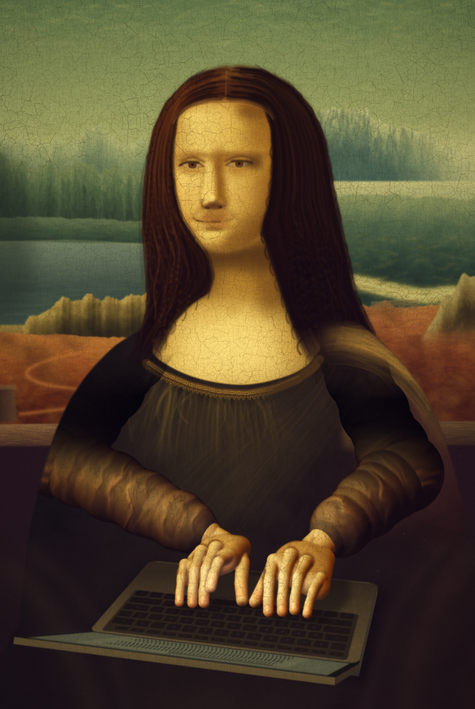

# Mona Lisa, typing



Leonardo's sitter in her loggia, in front of the same imaginary landscape, typing on a laptop. [`mona_lisa_typing.py`](mona_lisa_typing.py) draws every pixel of [`mona_lisa_typing.png`](mona_lisa_typing.png) with pycairo and numpy; nothing is copied from the painting. The image is 960 × 1431, the size of the reference scan, and takes about two minutes to render on one core.

The request, from Oskar: *"Iteratively, checking your results as you go, generate as high fidelity as you can muster, a pyCairo version of Mona Lisa typing on a laptop. Be creative and critical of your own work."*

## How it is drawn

| Layer | Technique |
|---|---|
| Landscape | Ridge profiles from ridged 1D noise, shaded by depth below the crest and by slope toward the light; about 30,000 brush touches scattered through cairo; aerial haze and a light blur |
| Face and neck | A height field (ellipsoid head plus gaussian brow, sockets, cheeks, nose, lips and chin) lit from the upper left, then about 60 blurred glazes; a local-contrast pass (`img + 0.5 * (img - blur14)`) inside the face mask; the eyes are painted last so later glazes cannot wash them out |
| Hair and veil | Spline strands and corkscrew ringlets on transparent cairo layers, faded toward the shoulders; loose locks break the silhouette; the veil is a faint halo and an edge line across the brow |
| Dress and shawl | Pleats and gauze as low-alpha stroke fields; the neckline knotwork is two interlaced sinusoids with small looped motifs; the shawl is a lit band of strands over her left shoulder |
| Hands and sleeves | Sphere-swept capsules (fingers, palm, forearms, upper arms) rasterised into a z-buffer at 3× supersampling, normals smoothed per material, lit by Leonardo's key light plus cool light from the screen; nails are ovals on the dorsal face of each fingertip; the satin folds are a bump map along the arm axis plus about 900 short crinkle strokes where the sleeve is lit |
| Laptop | 3D geometry through a pinhole camera fitted so her face spans its painted width; key legends are set in her reading frame through a per-key affine matrix, so they read upside down to us; the screen is ray-cast onto the lid plane and samples a cairo-drawn document with a cursor; the machine is then warmed and softened like old bronze |
| Aging | Two Voronoi crack networks (17 px and 6.5 px cells, stretched vertically) with lifted-paint rims, vertical grain, yellowed varnish that leaves the darks cool, and a vignette |

## Checking against the original

The reference was `Mona_Lisa,_by_Leonardo_da_Vinci,_from_C2RMF_retouched.jpg` from Wikimedia Commons, 960 px thumbnail. It was used for measurement only: gridded crops to place landmarks, regional median colours, and heat maps of blurred-luminance difference (render minus reference). Over five rounds of corrections the face's mean absolute luminance difference went from 19 to 14 levels out of 255.

A separate critic subagent was shown both images without the process and ranked the eight worst defects. The last round fixed three of them: sleeves about twice as bright as the original and more saturated, surface texture 4–10× weaker than the panel's, and a laptop that read as a cool, crisp vector drawing.

## Known weaknesses

- The face is flatter and more evenly lit than Leonardo's, and the smile is weaker.
- The hair is wavy dark brown instead of loose ringlets with red and gold lights.
- The rocks at left read as columns more than weathered crags.
- The lid is open to about 157° and seen almost edge-on. That is geometrically right for her to read it, but it can make the laptop look like a tablet with a keyboard.

## Rebuild

```bash
sudo apt-get install libcairo2-dev pkg-config     # pycairo builds from source
pip install pycairo==1.29.1 numpy==2.4.4 scipy==1.17.1
python3 mona_lisa_typing.py                       # writes mona_lisa_typing.png
```

The PNG in this folder was rendered from the script on a GitHub Actions runner (ubuntu-24.04, the versions above), because the session that made it could not push binary files. It differs from the session's own render in one pixel, by one level.
