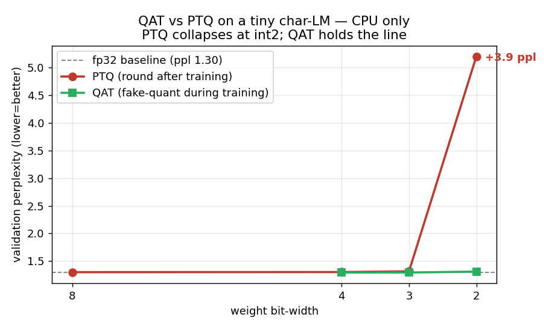

# qat-cpu-demo — can we run QAT locally, GPU-less?

**Question (2026-06-06):** Google's [Gemma 4 QAT post](https://blog.google/innovation-and-ai/technology/developers-tools/quantization-aware-training-gemma-4/)
ships int4 checkpoints that drop E2B to ~1 GB. *"Could we run a smaller
version of this locally in your GPU-less container environment?"*

**Answer: yes.** This is a faithful toy-scale reproduction of the post's
central claim — QAT beats post-training quantization (PTQ) at low bit-width —
trained end-to-end on **4 CPU cores in 2m13s, no GPU, no network, no external
data**.



## What the post actually claims

QAT "simulates quantization during training" so the model "wears the int4 grid
like a glove," yielding "higher overall quality compared to standard PTQ
baselines." The aggressive end of their stack uses **2-bit** quantization for
token generation. That 2-bit floor is exactly where the QAT-vs-PTQ gap is
supposed to bite.

## The technique, in ~20 lines

QAT isn't a heavy framework — it's two pieces:

1. **Fake-quant in the forward pass.** Round each weight to its N-bit grid
   (per-output-channel symmetric scale), then immediately de-scale, so the
   layer computes with the *quantized* weights but the tensor stays float.
2. **Straight-through estimator (STE) on the backward pass.** `round()` has
   zero gradient a.e.; STE passes the upstream gradient through unchanged so
   the optimizer can still learn. The model adapts its weights to survive the
   rounding.

```python
class FakeQuant(torch.autograd.Function):
    @staticmethod
    def forward(ctx, w, n_bits):
        qmax  = 2 ** (n_bits - 1) - 1
        scale = w.abs().amax(dim=1, keepdim=True).clamp(min=1e-8) / qmax
        return torch.clamp(torch.round(w / scale), -qmax-1, qmax) * scale
    @staticmethod
    def backward(ctx, g):
        return g, None                       # straight-through
```

PTQ = apply that rounding to a finished fp32 model and stop. QAT = re-init from
the fp32 weights, turn fake-quant on, and keep training ~1000 steps.

## Setup

- **Model:** 2-layer causal transformer, d=128, 4 heads, block 64 → 393 K
  quantizable linear weights. Char-level LM.
- **Data:** ~180 KB of combinatorially-generated subject/verb/object English
  (seeded, embedded in the script). Deliberately high-entropy so the perplexity
  floor sits well above 1 and low-bit rounding has real quality to destroy.
- **Quant:** per-output-channel symmetric, weight-only, linear layers only.

## Results

| method   | bits |   ppl | lin-MB | vs fp32 |
|----------|-----:|------:|-------:|--------:|
| fp32     |   32 |  1.30 | 1.573  |    —    |
| ptq_int8 |    8 |  1.30 | 0.393  |  +0.00  |
| ptq_int4 |    4 |  1.30 | 0.197  |  +0.00  |
| qat_int4 |    4 |  1.29 | 0.197  |  −0.01  |
| ptq_int3 |    3 |  1.31 | 0.147  |  +0.02  |
| qat_int3 |    3 |  1.29 | 0.147  |  −0.01  |
| **ptq_int2** | **2** | **5.21** | **0.098** | **+3.91** |
| **qat_int2** | **2** | **1.31** | **0.098** | **+0.01** |

**The int2 row is the whole story.** Rounding the trained model to 2 bits
post-hoc (PTQ) blows perplexity up **4×** — the model is effectively broken.
Training *with* the 2-bit grid in the loop (QAT) lands at 1.31, statistically
indistinguishable from the fp32 baseline, at the **same 0.098 MB** footprint —
a 16× shrink of the linear weights for ~free quality.

## Honest caveats

- **int4/int3 PTQ does not degrade here**, so the printed "QAT recovers 437% /
  147%" for those widths is noise — it divides by a ~zero gap. At this toy scale
  int4 is already "free"; the QAT advantage only materializes at the 2-bit floor.
  That mirrors the post's own engineering choice to reserve 2-bit for the
  hardest part (token generation), not to use it everywhere.
- **Weight-only, linear-only, per-channel** quant. The real Gemma stack also
  does static *activation* quantization, channel-wise schemes, and a
  mobile-specialized format — none of that is here.
- Train≈val on an embedded corpus; this demonstrates *quantization robustness*,
  not generalization.
- "MB" is theoretical (`params × bits / 8`), counting only the quantized linear
  weights — not embeddings, norms, or real packed-storage overhead.

## So, the bigger question

Two distinct "run this locally" readings, both feasible on this box (4 cores,
15 GB RAM, torch 2.11 CPU):

1. **The QAT technique** — proven above. Pure CPU arithmetic, ~2 min.
2. **Google's actual E2B int4 checkpoint for inference** — **done too, see
   [`inference/`](inference/README.md).** Pulled `gemma-4-E2B-it-qat-q4_0-gguf`
   (3.35 GB), built llama.cpp from source CPU-only, clocked **20.5 tok/s
   generation / 182 t/s prompt** on the 4 cores — faster than reading speed, no
   GPU. The model's own answer about why QAT beats PTQ is the exact mechanism
   this experiment measured at int2.

## Run it

```bash
python3 qat_demo.py          # ~2m13s on 4 CPU cores, writes results.json
```
