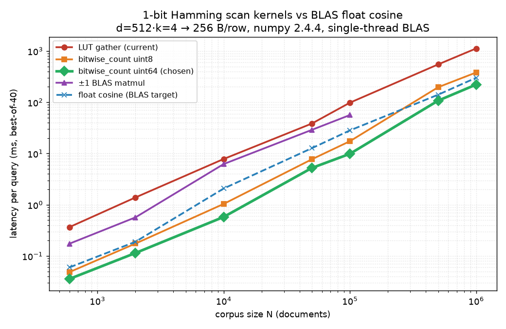

# remax_kb #15 — speeding up the 1-bit Hamming scan to beat BLAS float matmul

**Verdict:** A one-line kernel swap — replace the per-byte popcount **LUT gather**
with `np.bitwise_count` over a **uint64 view** of the XOR — makes the 1-bit
Hamming scan **~10× faster** than the current code and **faster than a BLAS
float-cosine scan at every corpus size**, while keeping the codes bit-packed at
rest (256 B/row). This is the issue's *cheapest* candidate (approach 1) and it
wins outright; the heavier ±1 matmul (approach 2) and a compiled SIMD kernel
(approach 3) are unnecessary.

Issue success criterion ("Hamming ≤ float-cosine BLAS at N ≥ 10k without losing
the 12× storage advantage") is **met and exceeded** — the win holds at *all* N,
not just ≥ 10k, with zero storage cost and no compiled dependency.

## Benchmark

`bench.py` — single query against the full corpus, best-of-40 reps, BLAS pinned
to one thread (`OPENBLAS_NUM_THREADS=1`) so the comparison is core-for-core.
Corpus mirrors the muninn micro-bench: `d=512, k=4` stacked 1-bit codes →
2048 bits = **256 B/row**; float baseline is 768-d fp32 (3072 B/row).
numpy 2.4.4, scipy-openblas 0.3.31 (Haswell/AVX2), 4-core container.

Latency per query, **ms** (lower is better):

| N | LUT gather (current) | bitwise_count u8 | **bitwise_count u64 (chosen)** | ±1 BLAS matmul f32 | float cosine (BLAS target) |
|--:|--:|--:|--:|--:|--:|
| 600 | 0.367 | 0.049 | **0.036** | 0.174 | 0.060 |
| 2,000 | 1.390 | 0.175 | **0.115** | 0.568 | 0.190 |
| 10,000 | 7.832 | 1.040 | **0.580** | 6.239 | 2.079 |
| 50,000 | 38.543 | 7.736 | **5.240** | 29.021 | 12.739 |
| 100,000 | 98.334 | 17.417 | **9.884** | 56.467 | 28.281 |
| 500,000 | 549.207 | 197.024 | **107.789** | — (OOM) | 140.779 |
| 1,000,000 | 1124.193 | 381.772 | **221.856** | — (OOM) | 301.354 |

(±1 matmul corpora are 8–32× the packed size and were skipped above N=100k.)



### Chosen kernel vs. the two reference points

| N | speedup vs current LUT | vs. BLAS float cosine |
|--:|--:|--:|
| 600 | **10.2×** | 1.7× faster |
| 10,000 | **13.5×** | 3.6× faster |
| 100,000 | **9.9×** | 2.9× faster |
| 1,000,000 | **5.1×** | 1.4× faster |

The current LUT scan was indeed ~6–10× slower than float cosine at small N (the
issue's reported 10× reproduces: 0.367 ms vs 0.060 ms at N=600). The uint64
`bitwise_count` path closes that gap and inverts it — Hamming is now the faster
kernel everywhere, *and* it carries a 12× storage advantage the float path can't.

## Why each approach landed where it did

- **Approach 1b — uint64 view + `np.bitwise_count` (WINNER).** `bitwise_count`
  (numpy ≥ 2.0) maps to a hardware POPCNT. Viewing the contiguous `(N, B)` uint8
  XOR as `(N, B/8)` uint64 cuts the element count 8× before the reduction, so
  both the popcount and the `sum(axis=1)` do 8× less work. Zero-copy, pure
  numpy, codes stay bit-packed. Beats BLAS at every N. **~10× over current.**
- **Approach 1a — `bitwise_count` on uint8 (no packing).** Still ~7× over the
  LUT (drops the gather + uint16 intermediate) and works for *any* row width.
  ~1.5× slower than the uint64 view, which is why u64 is the headline — but 1a is
  the universal fallback when `B % 8 ≠ 0`.
- **Approach 2 — ±1 BLAS matmul.** `q·D = nbits − 2·Hamming`, so ranking is
  identical. But a 2048-wide ±1 GEMM is *more* work than 32 uint64 popcounts:
  2–6× slower than the chosen kernel **and** 8–32× the RAM (it must un-pack the
  corpus to int8/fp32, forfeiting the storage win — it OOM'd at N=500k on 15 GB).
  Int8 ±1 is far worse: numpy has no int8 GEMM, so it falls to an int16 path
  ~30× slower. Reusing BLAS doesn't help when the bit-parallel kernel already
  does 64 comparisons per instruction.
- **Approach 3 — compiled SIMD (numba/Cython/AVX-512 VPOPCNT).** Unnecessary:
  approach 1b already beats BLAS in pure numpy. Not worth a build dependency for
  this corpus regime. (Would only matter for a GPU/bit-sliced large-N rewrite.)

## Correctness

The uint64 regrouping is summed over the whole row, so byte order is irrelevant —
the result is **bit-for-bit identical** to the per-byte LUT. Verified exact
(distances, top-k, dtype, value range) against the frozen original across eight
realistic `(dim, k)` widths, including widths where `B` is **not** a multiple of
8 (`dim·k` not a multiple of 64 → the code falls to the uint8 path). The
numpy<2.0 LUT fallback was also verified exact. See
`remax_kb/tests/test_hamming.py` (added in the PR; 20 cases, remax-free).

## Shipped change (remax_kb PR)

`remax_kb/_hamming.py` — `hamming_scan` now delegates to a shared
`_popcount_rows(xor)` helper:

```python
_HAS_BITWISE_COUNT = hasattr(np, "bitwise_count")  # numpy>=2.0; floor is 1.24

def _popcount_rows(xor):                    # contiguous (N, B) uint8
    if _HAS_BITWISE_COUNT:
        if xor.shape[1] % 8 == 0:
            xor = xor.view(np.uint64)       # 8x fewer elements -> hw POPCNT
        return np.bitwise_count(xor).sum(axis=1, dtype=np.int32)
    return POPCOUNT_LUT[xor].sum(axis=1, dtype=np.int32)   # numpy<2.0 fallback
```

`read_v2.py` had a second, identical LUT popcount (`_popcount_rows` + its own
`_POPCOUNT_LUT`); it now imports the shared helper, so the v2 split-index reader
gets the same speedup and the duplication is gone. The `numpy>=1.24` floor is
preserved by the LUT fallback — no dependency bump.

## Post-merge reproduction (jina-v5-nano-mirror PERFORMANCE.md refresh)

After remax_kb#16 merged, `repro_merged.py` re-times the **shipped** kernel —
`remax_kb._hamming.hamming_scan` imported straight from the checkout, not the
standalone reimplementation in `bench.py` — against the same BLAS float-cosine
baseline, to refresh the mirror's `PERFORMANCE.md` "Small, not fast at small N"
caveat (which cited the *pre*-#16 LUT: float cosine beat Hamming 0.05 vs 0.50
ms/query @600 docs).

Merged kernel, ms/query (4-vCPU, single-thread BLAS, d=512/k=4 → 256 B/row, best-of-40):

| N | Hamming (merged) | float cosine (BLAS) | winner | Hamming speedup |
|--:|--:|--:|:--|--:|
| 600 | 0.039 | 0.074 | **Hamming** | 1.9× |
| 2,000 | 0.127 | 0.253 | **Hamming** | 2.0× |
| 10,000 | 0.725 | 1.851 | **Hamming** | 2.6× |
| 50,000 | 4.25 | 12.33 | **Hamming** | 2.9× |
| 100,000 | 10.98 | 25.08 | **Hamming** | 2.3× |
| 500,000 | 116.7 | 124.2 | **Hamming** | 1.1× |
| 1,000,000 | 237.9 | 252.3 | **Hamming** | 1.1× |

The caveat is **inverted**: the merged Hamming scan now beats float cosine at
*every* N, including the 600-doc muninn scale where the LUT used to lose. The
`PERFORMANCE.md` "Small, not fast" caveat was rewritten accordingly
([jina-v5-nano-mirror PR](https://github.com/oaustegard/jina-v5-nano-mirror/pulls)).
(Absolute numbers differ from the doc's original 0.05/0.50 — different
hardware/corpus — but the relative story is what changed: cosine-wins → Hamming-wins.)

## Reproduce

```bash
pip install numpy matplotlib            # numpy>=2.0 for the fast path
OPENBLAS_NUM_THREADS=1 python3 bench.py          # candidate sweep -> results.json
python3 plot.py                                  # -> latency.png
OPENBLAS_NUM_THREADS=1 python3 repro_merged.py   # merged shipped kernel -> repro_merged.json
```

`--quick` runs a 3-point sweep. Files: `bench.py` (kernels + timing +
ranking-equivalence assertions), `plot.py`, `results.json`, `latency.png`,
`repro_merged.py` / `repro_merged.json` (post-merge shipped-kernel timing).
