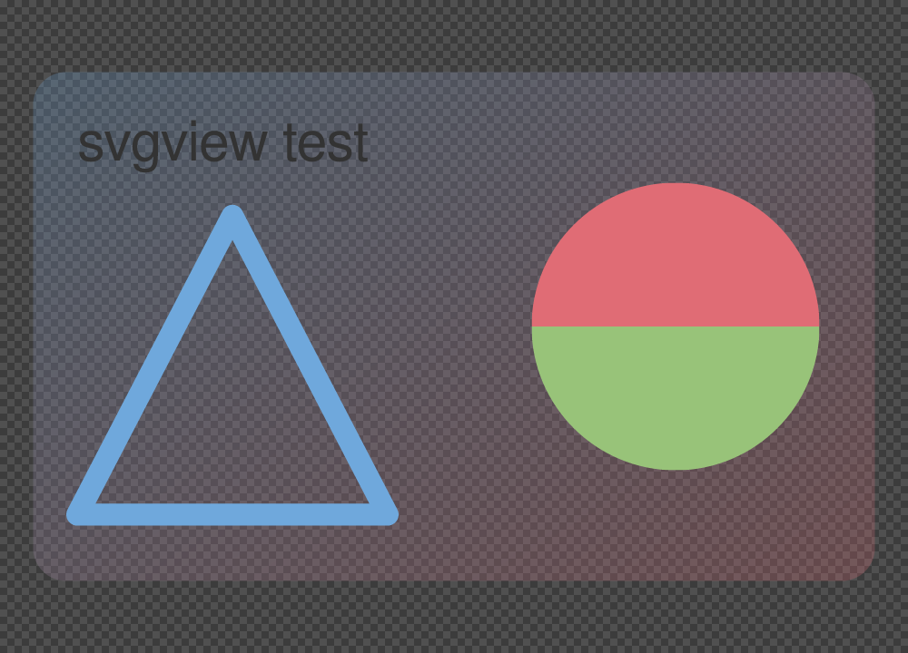

# svgview

A small native SVG viewer for Windows, built on [`resvg`](https://github.com/linebender/resvg).
No browser, no web engine, no bundled runtime — one executable that opens
instantly and re-rasterises the vector art every time you zoom.

Windows has no built-in SVG viewer: double-clicking an `.svg` hands it to Edge,
which spins up a browser to draw a few hundred paths. This is the same job
without the browser.



## Measured

Numbers from an x86-64 Linux container, release profile (`lto = "fat"`,
`codegen-units = 1`, `panic = "abort"`, `strip = true`). They are here to show
the order of magnitude, not to be a benchmark:

| | |
|---|---|
| Executable | 5,002,648 bytes (4.8 MiB), no external runtime |
| Resident set, one document open | 12 MiB |
| `exec` → window on screen | 16 ms (mean of 5) |
| Parse + render to a 1000 px PNG, no text | 20 ms (mean of 10, includes process spawn) |
| Same, with text | 34 ms — the extra 14 ms is the system font database |

That font-database cost is why `doc.rs` scans the source for `<text`,
`<tspan`, and `font-family` before deciding to enumerate system fonts. Most
SVGs in the wild — icons, logos, plots — have no text at all and skip it.

The Windows executable is built in CI but has **not** been measured or
interactively tested; see [Platform status](#platform-status).

## Build

Needs a Rust toolchain (1.85+) and nothing else — no vcpkg, no system SVG or
image libraries.

```
cargo build --release
```

The binary lands at `target/release/svgview.exe`. On Windows the release
profile builds as a GUI subsystem app, so no console window flashes up when
Explorer launches it; debug builds keep the console so `eprintln!` diagnostics
stay visible.

## Use

```
svgview drawing.svg        # open a file
svgview                    # empty window, drop a file on it
```

| Key | |
|---|---|
| `Ctrl+O` | open a file (Windows: native dialog) |
| drag & drop | open a dropped file |
| wheel | zoom, anchored at the pointer |
| drag, arrow keys | pan |
| `Ctrl+0` | fit to window |
| `Ctrl+1` | actual size (100%) |
| `Ctrl++` / `Ctrl+-` | zoom in / out |
| `B` | cycle background: checkerboard → white → black → grey |
| `R` | reload from disk |
| `Ctrl+S` | export a PNG at the current zoom |
| `F11` | fullscreen |
| `H` | key list |
| `Esc`, `Ctrl+W` | close |

A file open in the viewer is re-read automatically when it changes on disk, so
you can keep it open next to an editor. If a save leaves the file temporarily
unparseable, the last good render stays on screen.

`.svgz` (gzipped SVG) works everywhere `.svg` does.

### Headless

The same binary renders without opening a window, which is what the tests use:

```
svgview drawing.svg --png out.png --width 1024
svgview drawing.svg --png out.png --scale 2
```

Exported PNGs keep their alpha channel — the on-screen checkerboard is never
baked in.

## Windows file association

Per-user, no administrator rights, nothing written outside `HKCU`:

```powershell
powershell -ExecutionPolicy Bypass -File .\install\Register-SvgView.ps1
```

This registers a ProgID and adds svgview to the "Open with" list for `.svg`
and `.svgz`. It deliberately does not seize the default handler — since
Windows 8 only the user can change that, through Explorer's "Open with →
Choose another app → Always" or Settings. `Unregister-SvgView.ps1` reverses it.

## Layout

```
src/main.rs     argument parsing, headless PNG mode, event-loop startup
src/doc.rs      loading SVG into a usvg::Tree; the welcome/help/error screens
src/view.rs     pan-zoom state and rasterisation into a pixmap
src/app.rs      the winit application: window, input, redraw
assets/         test document, app icon, and the tools that build them
install/        Windows file-association scripts
scripts/        end-to-end smoke test
```

The viewer chrome — welcome screen, key list, error messages — is itself
generated SVG rendered through the same code path as any other document. There
is no separate text renderer or UI toolkit. The app icon is generated too:
`assets/make-icon.py` rasterises `assets/icon.svg` at seven sizes *using
svgview itself* and packs them into an `.ico`, so the icon can never drift from
the artwork.

**The one architectural rule**: nothing below `winit` and `tiny-skia` is
allowed. Reaching for Direct2D, or Windows' built-in `Windows.Data.Pdf`-style
APIs, would shave a megabyte and cost the entire macOS/Linux branch. The only
`cfg(windows)` code in the project is the `Ctrl+O` file dialog and the GUI
subsystem attribute.

## Tests

```
cargo test              # 18 unit tests: parsing, escaping, fit/zoom maths, blitting
scripts/smoke-test.sh   # drives the real window under Xvfb
```

The smoke test starts the actual binary on a virtual display, sends real key
events with `xdotool`, and captures the framebuffer after each one. Checks
compare consecutive frames: a key that should change the picture must change
the bytes, and a toggle pressed twice must return to the exact frame it started
from.

It is written that way because the first version counted distinct colours in
each screenshot instead, and reported `ok` for all seven key bindings while
none of them were reaching the window — with no window manager on the virtual
display, nothing had assigned input focus, so every keystroke went to the root
window. The fix was `xdotool windowfocus`; the lesson was that a check which
cannot fail is not a check.

Needs `Xvfb`, `xdotool`, and `libxkbcommon-x11-0`.

## Platform status

| | |
|---|---|
| Linux (x86-64) | built, unit tests and smoke test pass, timings above measured here |
| Windows | compiles in CI; **not** interactively tested — the file dialog, the file-association scripts, the embedded icon, and the GUI subsystem behaviour all need a real machine |
| macOS | should build (every dependency is cross-platform), never attempted |

## Limits

`resvg` renders **static** SVG. It is excellent at that — its conformance on
SVG 1.1 statics is better than most non-browser renderers — but this viewer
inherits its boundaries:

- no SMIL animation, no scripting, no interactivity inside the document
- CSS support is the static subset `usvg` resolves at parse time
- no text selection, no search, no printing
- no tabs, no thumbnails, no directory browsing

If you need an animated or scripted SVG to actually run, you need a browser.
That is the honest half of the argument this was built to test.

## Licence

MIT OR Apache-2.0, at your option.
